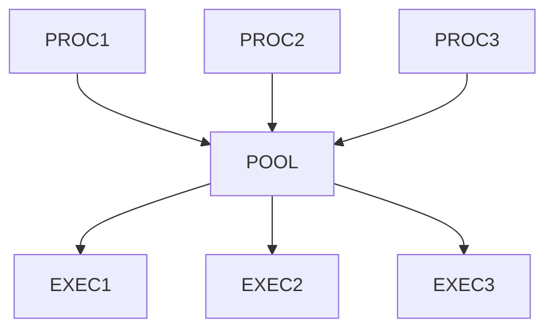

# offchain-sdk
A framework for building off-chain services for EVM chains.

## 🚧 WARNING: UNDER CONSTRUCTION 🚧

This project is a work in progress and subject to frequent changes as we are still working on wiring up the final system.
It has not been audited for security purposes and should not be used in production yet.

